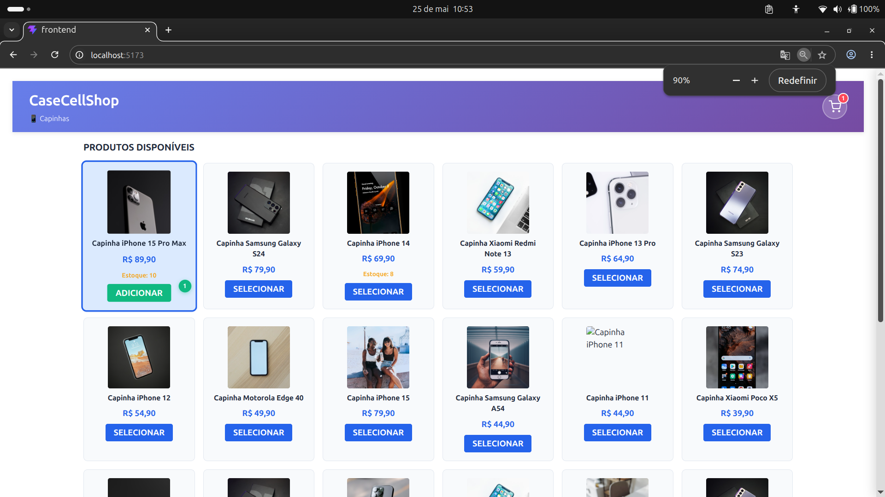
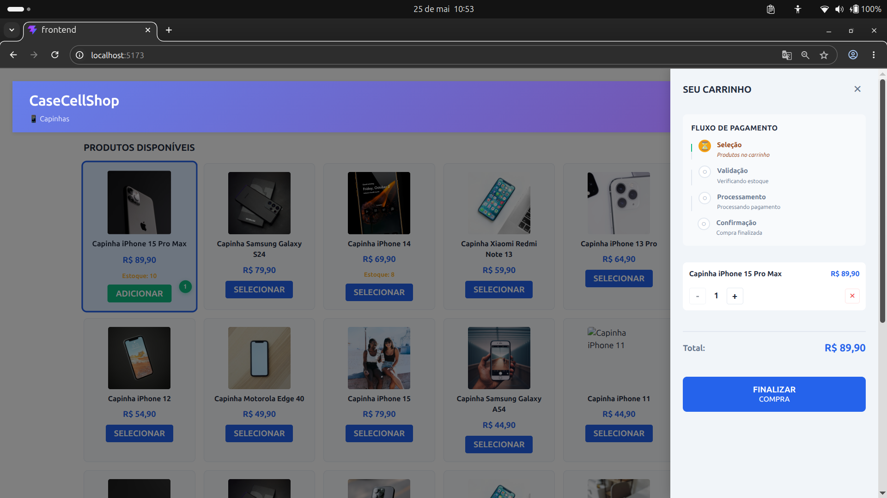
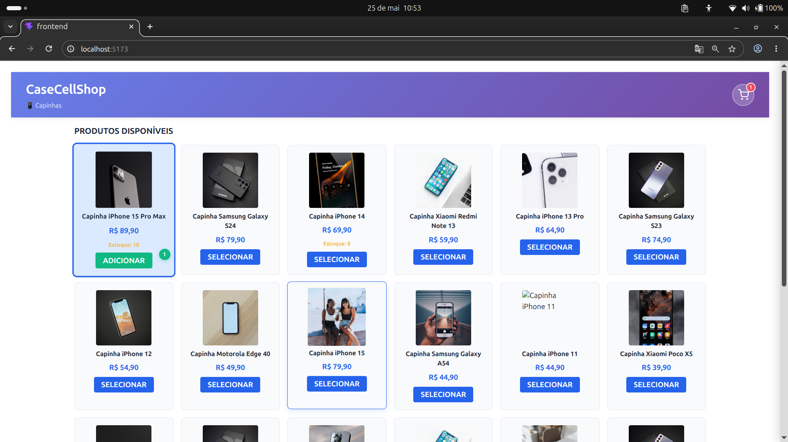
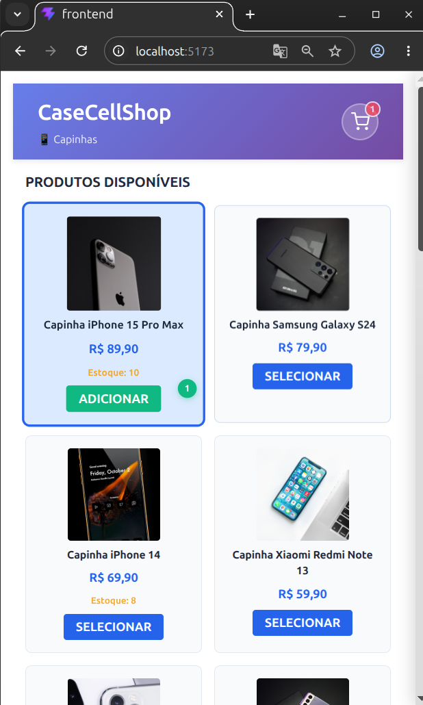
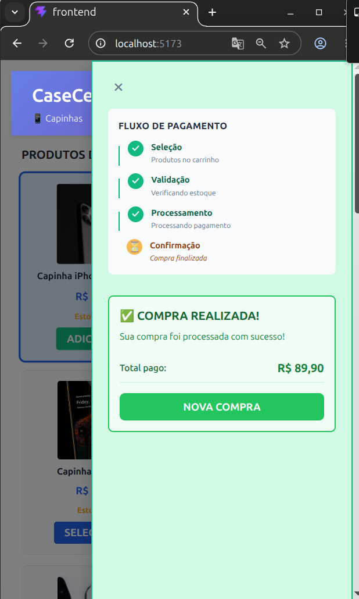

# CaseCellShop - Sistema de Checkout

Sistema de checkout para compra de capinhas de celular com backend e frontend.

## Cenário de Negócio

A CaseCellShop é uma loja virtual de capinhas de celular que enfrenta problemas críticos no processo de checkout. O sistema atual depende de um ERP externo que causa lentidão na vitrine de produtos, permite vendas além do estoque disponível e sofre com timeouts durante o processamento de compras.

## Problemas Resolvidos

**01 - Vitrine lenta**
- A loja virtual chamava o ERP a cada visualização de produto, sobrecarregando o sistema
- Clientes desistiam da compra antes mesmo de começar devido à lentidão
- Solução: Cache de produtos para reduzir chamadas ao ERP

**02 - Estoque vendendo mais do que tem**
- Quando duas pessoas tentavam comprar o mesmo produto simultaneamente, o sistema permitia ambas as reservas
- Após a compra, descobria-se que não havia estoque suficiente, gerando cancelamentos
- Solução: Bloqueio de estoque atômico no momento do checkout

**03 - Checkout falhando**
- Requisições ao ERP sofriam timeout durante o processamento de compras
- Compras se perdiam e clientes ficavam frustrados
- Solução: Processamento assíncrono com fila de mensagens

## Stack Tecnológica

### Backend
- **Node.js** + **TypeScript** - Runtime e tipagem estática
- **Express** - Framework web para API REST
- **Vitest** + **Supertest** - Testes de integração
- **Arquitetura**: Controller, Service, Repository, DTO, Model, Middleware

### Frontend
- **React 19** + **TypeScript** - Biblioteca UI e tipagem estática
- **Vite** - Build tool e dev server
- **Axios** - Cliente HTTP para chamadas de API
- **Playwright** - Testes e2e
- **CSS puro** - Estilização sem frameworks

## Como Instalar e Rodar

### Pré-requisitos
- Node.js (versão 18 ou superior)
- npm ou yarn

### Instalação

```bash
# Clone o repositório
git clone https://github.com/vinicius00franco/meta-desafio-fullstack.git
cd META

# Instalar dependências (executar na raiz para workspaces)
npm install
```

### Rodar o Backend

```bash
cd backend
npm run dev    # Inicia servidor na porta 3000
npm test       # Roda testes de integração
npm run build  # Compila TypeScript
```

### Rodar o Frontend

```bash
cd frontend
npm run dev       # Inicia servidor na porta 5173
npm run test:e2e  # Roda testes e2e
npm run build     # Compila para produção
```

## Estrutura do Projeto

```
META/
├── backend/     # API REST (Node.js + Express)
├── frontend/    # Interface React
├── bdd/         # Cenários BDD
├── docs/        # Documentação de requisitos e design
└── plans/       # Planos de implementação
```

## Status

- ✅ Backend implementado
- ✅ Frontend implementado
- ✅ Testes backend funcionando
- ✅ Testes frontend configurados

## Screenshots do Sistema

### Tela Inicial - Lista de Produtos


### Tela de Produto Selecionado


### Tela de Checkout - Detalhes


### Tela de Checkout - Confirmação e Sucesso
<div style="display: flex; gap: 20px;">
  <div>
    
    <p><strong>Confirmação</strong></p>
  </div>
  <div>
    
    <p><strong>Sucesso</strong></p>
  </div>
</div>

## Documentação

- `PROJECT.md` - Documentação completa do projeto
- `docs/01-requisitos/` - Requisitos funcionais e regras de negócio
- `docs/02-design/` - Design da interface e arquitetura
- `backend/README.md` - Documentação do backend
- `frontend/README.md` - Documentação do frontend
